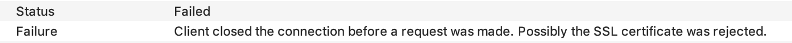
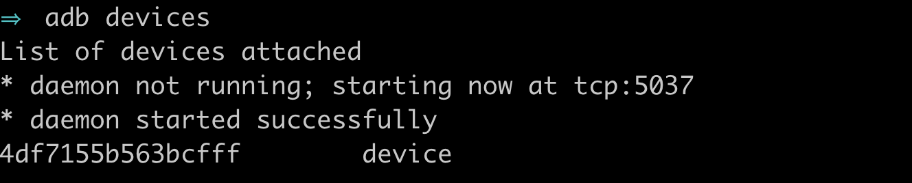
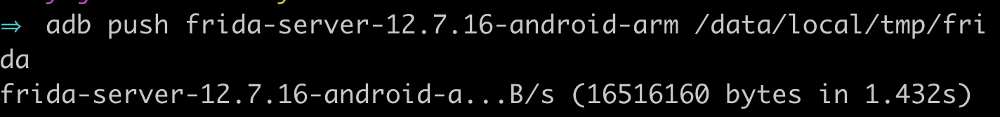
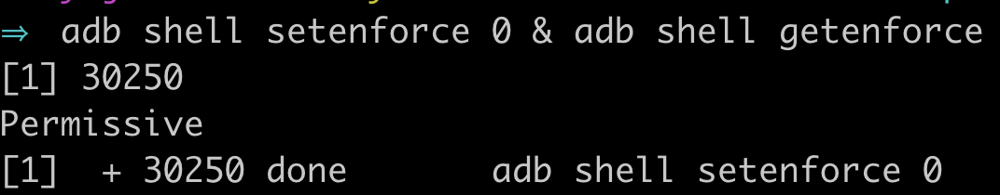
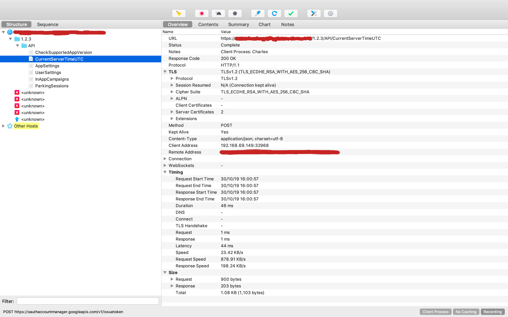

There is a company operating in my hometown that I really dislike. I won't name them or go into too much detail about what they do for fear of them going after me (they are that kind of company). Let's just say that this company has a monopoly over a particular service, and they use this position of power to threaten people into paying them unfair amounts of money.

This company has a phone app which you can use to pay for their service and recently I had a go at sniffing the requests. The app uses certificate pinning which means that you cannot use your own certificate when making requests. After playing around with some tools I managed to disable the pinning so that I could view the requests that they were sending. This revealed some pretty interesting stuff, including a potential security flaw in their payment method (which
I will go into later). 

I have no plans to abuse what I have found. It just makes me feel good to crack their security (kind of like knowing one of your bully's embarressing secrets but deciding to keep it to yourself). This method, however, is pretty useful for a bunch of things (such as making an android version of an iOS app, or keeping black-box testing out of your production code) so I thought I'd outline the process I used for others who'd like to learn.

<!-- more -->

<h2>What you'll need</h2>

<ul>
<li>A rooted phone</li>
<li>A copy of the <a href="https://www.charlesproxy.com/">Charles Web Debugging Proxy App</a></li>
<li>The <a href="https://developer.android.com/studio/command-line/adb?gclid=EAIaIQobChMIoPHAkbXA5QIVCSQrCh280AMZEAAYASAAEgKdKvD_BwE">adb</a> command-line tool installed on your computer</li>
<li>The latest version of <a href="https://github.com/frida/frida/releases">frida-server</a> (make sure you download the server and not the dev kit or tools)</li>
<li><a href="https://www.frida.re/docs/frida-cli/">frida-cli</a> installed on your computer</li>
</ul>

<h2>Installing the Charles Root Certificate</h2>

Once you've downloaded and installed the above tools (except for frida-server - we will explain how to use that later), you will need to install the Charles root certificate on your phone. This is what we will be using to handle the SSL handshake (more of this <a href="https://www.charlesproxy.com/documentation/proxying/ssl-proxying/">here</a>).

To do this, open Charles and go to the help section. Scroll down to SSL Proxying > Install Charles Root Certificate on Mobile or Remote Browser. Follow the instructions outlined here to install your unique certificate.

For apps without certificate pinning, this should be all you need to begin sniffing requests. Unfortunately, with our app, the requests fail.

This is where frida comes in.

<h2>Setting up Frida on your phone</h2>

Frida is a tool that allows you to inject snippets of JavaScript into native apps on Windows, macOS, Linux, iOS, Android, and QNZ. Basically it injects the Google v8 engine into whatever process you have identified, allowing you to hook into functions and change what they do while they are running. If you've used <a href="https://addons.mozilla.org/en-US/firefox/addon/greasemonkey/">Greasemonkey</a> or <a
href="https://chrome.google.com/webstore/detail/tampermonkey/dhdgffkkebhmkfjojejmpbldmpobfkfo?hl=en">Tampermonkey</a> for on-the-fly changes to a web page then you may be familiar with this idea.

Setting up frida is pretty easy:
<ul class="list">
<li>
First, <a href="https://developer.android.com/studio/debug/dev-options">toggle the developer settings</a> on your phone and make sure Android Debugging is enabled (you can also connect to your phone over the network using the 'adb connect' command if you do not have a USB cable handy) 
</li>
<li>Open a terminal and type adb devices to confirm your device is available:

</li>
<li>Make sure adb is running as root: adb root</li>
<li>Use the adb push command to push frida-server to your phone:

</li>
<li>Change the permissions of the server using 
adb shell chmod 755 /data/local/tmp/frida
</li>
<li>Confirm the version of frida-server matches what you installed using adb shell /data/local/tmp/frida --version
</li>

<li>
Once frida is on your phone, you need to downgrade SELinux to "Permissive" using adb shell setenforce 0 & adb shell getenforce:

</li>
<li>
You should now be able to run the frida server using adb shell /data/local/tmp/frida&

</li>
</ul>

<h2>Disable SSL Pinning (hopefully)</h2>

Floating around the internet is a universal snippet of code for disabling certificate pinning using Frida. Most widely used apps will have implemented pinning within their app, but there is a surprising number that rely on the built-in SSL pinning for android. Our app happens to be one of them.

To reverse pinning, all we need to do is hook into the app and run the following code:


Java.perform(function() {

    var array_list = Java.use("java.util.ArrayList");
    var ApiClient = Java.use('com.android.org.conscrypt.TrustManagerImpl');

    ApiClient.checkTrustedRecursive.implementation = function(a1,a2,a3,a4,a5,a6) {
            var k = array_list.$new();
            return k;
    }

},0);


We can do this using frida-cli. Go ahead and open another terminal and attach to your process:

frida -U process-name

Make sure you use the -U command to specify that you want to attach to the USB device and not your computer

You can find the process name using <a href="https://www.frida.re/docs/frida-ps/">frida-ps</a>

You should now be inside the frida REPL. Go ahead and copy the above code into the REPL. If everything goes well...nothing should happen.

Now head back over to Charles. Hopefully you will now be able to sniff requests!

If not, I'm sorry but you're out of luck. The app probably has pinning built into it and you are going to have to some more drastic things to disable it. Perhaps another post for another time?

And what was that security risk, you ask?

They seem to be setting the price on the client side :s
